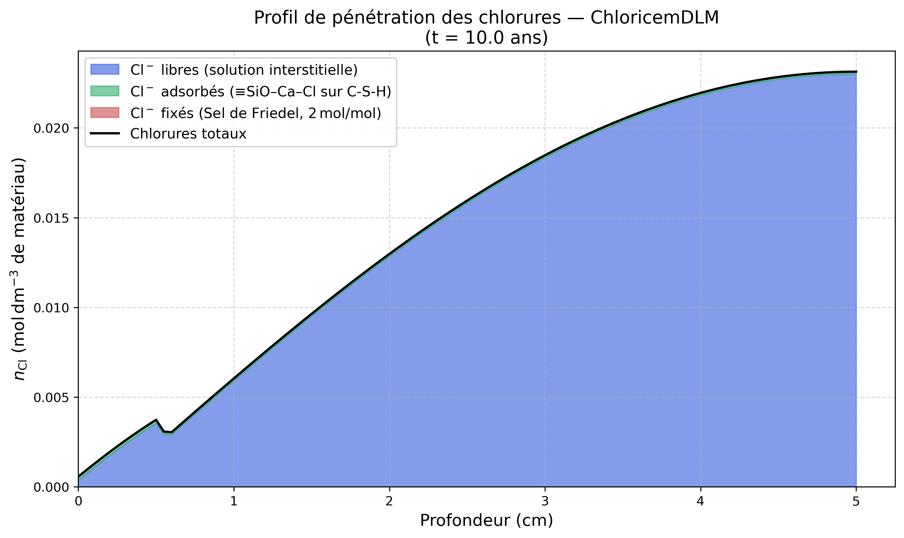

# Modèle ChloricemDLM — Transport Réactif et Adsorption des Chlorures (DLM)

> **Fichiers sources :**
> `src/Models/ModelFiles/ChloricemDLM.cpp` · `base/ChloricemDLM/ChloricemDLM`

---

## Table des matières

1. [Contexte et objectif](#1-contexte-et-objectif)
2. [Hypothèses et variables](#2-hypothèses-et-variables)
3. [Modèle de la double couche diffuse (DLM) pour l'adsorption](#3-modèle-de-la-double-couche-diffuse-dlm-pour-ladsorption)
4. [Cinétique de précipitation](#4-cinétique-de-précipitation)
5. [Cas test : Pénétration dans le béton (test `base/ChloricemDLM`)](#5-cas-test--pénétration-dans-le-béton-test-basechloricemdlm)
6. [Description pas-à-pas du paramétrage matériel](#6-description-pas-à-pas-du-paramétrage-matériel)
7. [Références bibliographiques](#7-références-bibliographiques)

---

## 1. Contexte et objectif

Le modèle **ChloricemDLM** modélise la pénétration, la diffusion et l'interaction chimique des ions chlorures ($\text{Cl}^-$) dans la matrice poreuse d'un matériau cimentaire (béton). L'exposition aux chlorures (provenant de l'eau de mer ou de l'application de sels de déverglaçage) est l'une des causes majeures de corrosion des armatures en acier.

Contrairement à des modèles simplifiés d'adsorption par des isothermes empiriques ou des capacités fixes, ce modèle introduit une chimie de surface avancée. Il décrit rigoureusement l'adsorption des ions sur les sites silanols ($\text{SiOH}$) des hydrates de silicate de calcium (C-S-H) en utilisant le Modèle de la Couche Diffuse (**Diffuse Layer Model - DLM**). De plus, ce processus est couplé à la reprécipitation simultanément compétitive d'une phase solide : le **Sel de Friedel**.

---

## 2. Hypothèses et variables

Le transport réactif obéit à plusieurs principes multi-physiques :
1. **Diffusion Multi-espèces** : Déplacement de plusieurs ions inter-dépendants ($\text{Cl}^-$, $\text{Ca}^{2+}$, $\text{OH}^-$, $\text{Na}^+$, $\text{K}^+$) dans la phase liquide interstitielle.
2. **Couplage d'électroneutralité** : Gestion du gradient du potentiel électrique et de la mobilité différentielle des espèces par le potentiel de membrane.
3. **Réactions locales** : Les concentrations en solution se convertissent via équilibres thermodynamiques et thermocinétiques en fractions adsorbées et solides.

### Variables clés du modèle (unités typiques dans `Bil`)
| Symbole code BIL | Signification Physique |
|------------------|------------------------|
| `c_cl_l` | Concentration libre en ions chlorures dans l'eau de pores ($\text{mol}/\text{L}_{\text{eau}}$) |
| `adsorbed chloride` | Moles de chlorures fixés électrostatiquement sur le réseau poreux C-S-H |
| `n_friedelsalt` | Moles de gisement minéral précipitées sous forme cristallisée |
| `n_Cl` | Chlorures totaux accumulés (somme des trois précédents états partiels du tissu matériel) |
| `psi` | Potentiel micro-électrostatique de surface $\Psi_0$ lié à la double couche |

---

## 3. Modèle de la double couche diffuse (DLM) pour l'adsorption

Le modèle thermodynamique retranscrit l'ensemble des réactions de complexation de surface du C-S-H extraites de la base de données thermodynamique (`thermodatabase.out`, format PHREEQC). Il incorpore un facteur de correction de Boltzmann $\beta = \exp\left(-\frac{F \, \Psi_0}{R \, T}\right)$ propre à l'énergie de Gouy-Chapman :

$$
\begin{align}
\equiv \text{SiOH} &\rightleftharpoons \equiv \text{SiO}^- + \text{H}^+  & (K_{a1})\\
\equiv \text{SiO}^- + \text{Ca}^{2+} &\rightleftharpoons \equiv \text{SiOCa}^+  & (K_{\text{Ca}})\\
\equiv \text{SiOCa}^+ + \text{Cl}^- &\rightleftharpoons \equiv \text{SiOCaCl}^0 & (K_{\text{Cl}})\\
\equiv \text{SiOH} + \text{Cl}^- &\rightleftharpoons \equiv \text{SiOHCl}^- & (K_{\text{OHCl}})\\
\equiv \text{SiO}^- + \text{Na}^+ &\rightleftharpoons \equiv \text{SiONa}^0 & (K_{\text{Na}})\\
\equiv \text{SiO}^- + \text{K}^+ &\rightleftharpoons \equiv \text{SiOK}^0 & (K_{\text{K}})
\end{align}
$$

La réaction (4) représente l'adsorption en sphère externe de $\text{Cl}^-$ directement sur le site neutre $\equiv\text{SiOH}$ (sans déprotonation préalable). Les réactions (5) et (6) modélisent la compétition de $\text{Na}^+$ et $\text{K}^+$ pour les sites $\equiv\text{SiO}^-$ ; ces espèces neutres n'ont pas de correction électrostatique mais réduisent les sites disponibles pour $\text{Cl}^-$.

La charge nette de surface et la concentration adsorbée s'écrivent avec $A = K_{a1}/c_h$, $B = K_{Ca} c_{Ca}$, $C = K_{Cl} c_{Cl}$, $D_{Cl} = K_{OHCl} c_{Cl}$, $E = K_{Na} c_{Na}$, $G = K_K c_K$ :

$$
\text{Den} = 1 + \frac{A}{\beta} + A B \beta + A B C + \frac{D_{Cl}}{\beta} + A E + A G
$$

$$
\Gamma_{Cl} = \Gamma_{max} \, \frac{A B C + D_{Cl}/\beta}{\text{Den}}
$$

$$
\sigma_{surf} = \frac{F \Gamma_{max}}{a_s} \cdot \frac{A B \beta - A/\beta - D_{Cl}/\beta}{\text{Den}}
$$

Le potentiel $\Psi_0$ (via $\beta$) est résolu par Newton-Raphson en égalisant $\sigma_{surf}$ à la charge de la couche diffuse de Gouy-Chapman $\sigma_{GC} = \sqrt{8 \varepsilon_0 \varepsilon_r R T I}\,\sinh(F\Psi_0/2RT)$.

---

## 4. Cinétique de précipitation

En parallèle du piégeage surfacique par la couche diffuse, une fixation irréversible s'opère dans la masse sous forme de co-précipitation minérale appelée "Sel de Friedel" ($3\text{CaO}\cdot\text{Al}_2\text{O}_3\cdot\text{CaCl}_2\cdot10\text{H}_2\text{O}$) :

$$
3\text{CaO}\cdot\text{Al}_2\text{O}_3 + \text{Ca}^{2+} + 2\text{Cl}^- + \dots \rightleftharpoons \text{Sel de Friedel}
$$

Les **chlorures totaux** mesurables (par exemple par perte au feu ou titrage expérimental) sont analytiquement la somme des chlorures dissous libres (aqueux), des chlorures adsorbés à court terme (C-S-H), et des chlorures cristallisés (Sel de Friedel).

---

## 5. Cas test : Pénétration dans le béton (test `base/ChloricemDLM`)

Ce cas de référence simule un milieu cimentaire (béton) soumis à un milieu marin extérieur. Le modèle thermodynamique capture la lente diffusion réactive dans la paroi, avec résolution des potentiels électriques à chaque étape.

### 5.1. Géométrie
Le domaine est modélisé par un maillage 1D d'une épaisseur totale de **5 cm (0.5 dm)**, divisé en 100 éléments spatiaux de taille finie régulière (pas de $0.5\text{ mm}$).
- La face en $x = 0$ est exposée continuellement aux conditions extérieures.
- La face en $x = 5\text{ cm}$ est considérée étanche vers l'intérieur (limite à flux nul).

### 5.2. Conditions Initiales
Le réseau cimentaire est chimiquement à l'équilibre métastable et quasi-vierge de chlorures :
- **Minéralogie solide** : Présence nominale de Portlandite (`1.64` mol) et de gel C-S-H (`0.635` mol).
- **Solution interstitielle** : La concentration initiale des électrolytes cibles au sein du liquide poreux y est réduite à l'état de traces ($\log_{10} c_{\text{cl}} = -4.0$, soit $0.1\ \text{mmol/L}$).

### 5.3. Conditions aux Limites (immersion en eau de mer)
L'exposition externe simule l'aspersion à une concentration saline typiquement océanique de manière continue pendant une décennie. Une rampe mathématique (via les `Functions` BIL) bascule à l'interface les valeurs imposées en solution :
- **Chlorures $\text{Cl}^-$ limites** : Fixation à $\approx \mathbf{0.55\text{ mol/L}}$ ($\log_{10} c_{\text{cl}} = -0.260$), ce qui correspond chimiquement aux abondances standards de l'eau de mer (environ ~19.5 g/L massique).
- Les alcalins et le pH sont forcés, et le profil électrique de surface répond à la méthode Nernst-Planck.

La simulation s'étend sur une durée totale de **10 ans ($3.15 \times 10^8$ s)** par incrémentations d'intervalles annuels réguliers.

### 5.4. Profil des chlorures (Résultats à 10 ans)

Afin d'illustrer la composition interne des phases chimiques stockant le chlore après 10 années d'accumulation ininterrompue, on extrait le gradient multi-component :



*(L'empilement successif des chlorures aqueux libres en bleu, chimisorbés électriquement (via modèle interfacial DLM) en vert, et fixés par précipitation minéralogique (Sel de Friedel) en rouge brique, montre l'ampleur absolue du tamponnage de chlorures vis-à-vis du liquide poral. Cette combinaison forme la barrière ralentissant la progression corrosive aux armatures).*

---

## 6. Description pas-à-pas du paramétrage matériel

Dans le fichier d'entrée (`bil/base/ChloricemDLM/ChloricemDLM`) on précise l'architecture géochimique :

```text
Curves = AdDLM  x = Range{...} gamma_max=0.056 k_a1=2.0e-13 k_ca=2000. k_cl=0.40 a_s=25500.
```
C'est le profil renseignant la routine Elakneswaran-DLM. Les constantes sont dérivées de la base de données thermodynamique `thermodatabase.out` (format PHREEQC) :

| Paramètre | Valeur | Dérivation depuis la base |
|-----------|--------|--------------------------|
| `gamma_max = 0.056` | $0.056\ \text{mol/mol}_\text{CSH}$ | Capacité asymptotique totale des sites silanols |
| `k_a1 = 2.0e-13` | $K_{a1} = 10^{-12.7}\ \text{mol/L}$ | `CSH_O-` : $\log K_\text{net} = -12.7$ |
| `k_ca = 2000.` | $K_{Ca} = 10^{3.3}\ \text{L/mol}$ | `CSH_OCa+` : $\log K_\text{net}=-9.4 \Rightarrow K_{Ca} = 10^{3.3}$ |
| `k_cl = 0.40` | $K_{Cl} = 10^{-0.4}\ \text{L/mol}$ | `CSH_OCaCl` : $\log K_\text{net}=-9.8 \Rightarrow K_{Cl} = 10^{-0.4}$ |
| `k_ohcl = 0.447` | $K_{OHCl} = 10^{-0.35}\ \text{L/mol}$ | `CSH_OHCl-` : $\log K_\text{diss}=+0.35 \Rightarrow K_{OHCl} = 10^{-0.35}$ (formation, sphère externe) |
| `k_na = 0.090` | $K_{Na} = 10^{-1.045}\ \text{L/mol}$ | `CSH_ONa` : $\log K_\text{net}=-13.745 \Rightarrow K_{Na} = 10^{-1.045}$ |
| `k_k = 0.090` | $K_K = 10^{-1.045}\ \text{L/mol}$ | `CSH_OK` : $\log K_\text{net}=-13.745 \Rightarrow K_K = 10^{-1.045}$ |
| `a_s = 25500` | $25500\ \text{m}^2/\text{mol}_\text{CSH}$ | $S_\text{BET} = 150\ \text{m}^2/\text{g}$, $M_\text{CSH} = 170\ \text{g/mol}$ |

TOUGHREACT stocke des **constantes intrinsèques de dissociation** (complexe → composants primaires), sans correction électrostatique (celle-ci est appliquée à l'exécution via le facteur β). La constante de *formation* utilisée dans le code est l'inverse : $K_{ion}(\text{form}) = 10^{-\log K_\text{diss}}$.

Pour les espèces avec échange de H⁺ : $K_{diss} = 1/(K_{a1} \times K_{ion})$, d'où $K_{ion} = 10^{-\log K_\text{diss}} / K_{a1}$.

**Pour `CSH_OHCl-` (sans H⁺) :** la dissociation est ≡SiOHCl⁻ → ≡SiOH + Cl⁻ avec $\log K_\text{diss} = +0.35$, donc $K_{OHCl}(\text{formation}) = 10^{-0.35} \approx 0.447\ \text{L/mol}$. Utiliser directement $10^{+0.35}$ serait une erreur de signe.

```text
PrecipitationRate_calcite = 1.e-6
PrecipitationRate_friedelsalt = 1.e-6
```
Dicte la cinétique. En fonction du design, ce taux d'hydratation retarde l'avancée de la quantité destructrice "libre" au prix de l'envasement prématuré de la surface de C-S-H.

---

## 7. Références bibliographiques

- **Elakneswaran, Y., Nawa, T., Kurumisawa, K.** (2009). *Electrokinetic potential of hydrated cement in relation to solid–liquid interfacial phenomena*. Cement and Concrete Research, 39(4), 340-344. — Fondatrice de l'intégration des potentiels $\Psi_0$ de la théorie électrochimique DLM.
- **Nilsson, L. O. et al.** (1996). *Models for Chloride Penetration in concrete*. — Études des seuils de corrosion et description formelle physique de la mise à l'équilibre en double phase solvant/granulo-porosité.
